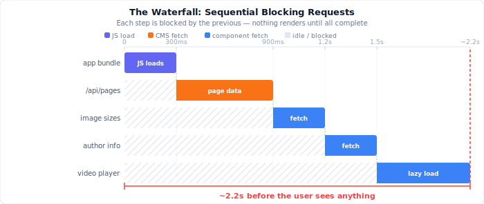
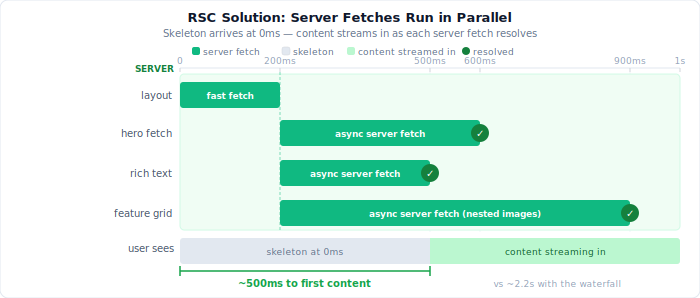
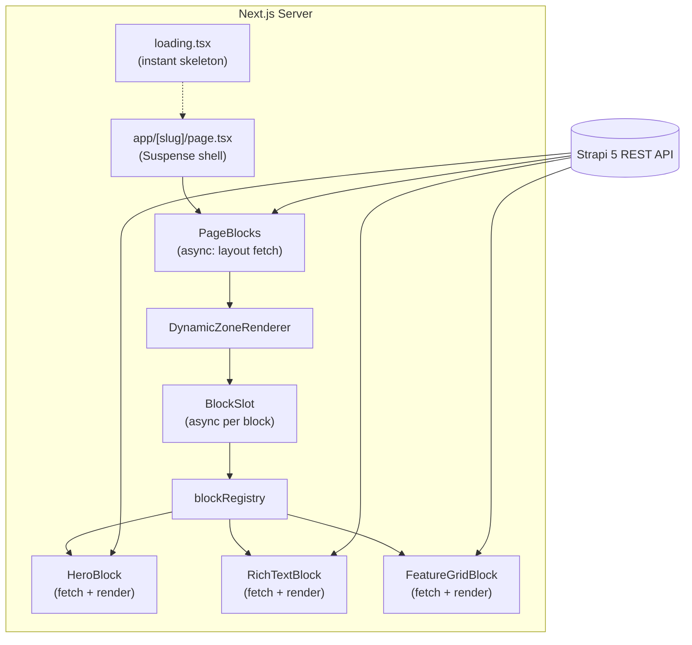

# Dynamic Zones in React Server Components (Next.js 16): Streaming Strapi Pages Without Client-Side Waterfalls

I have always been curious about how developers can make it easier for marketing teams to ship new pages on their own. Take a product landing page, a campaign page, and a seasonal promo, for example. Each one follows roughly the same structure but with different content and a different arrangement of sections. Since the building blocks (things like a hero, rich text, or a feature grid) stay more or less the same across these marketing pages, the right answer is to give editors a set of reusable components they can compose themselves, and only loop developers in when a genuinely new kind of block is needed.

That is exactly the problem [Dynamic Zones](https://strapi.io/features/dynamic-zone) solve in Strapi. Editors stack pre-built blocks in whatever order makes sense for each use case, and the codebase stays the same. Without a clear strategy though, you end up with blocks marked as client components "just in case", or have multiple `useEffect` hooks for media-heavy sections, and the page stalling on a waterfall of requests before anything meaningful appears.

In this guide, I will show you how to create a Dynamic Zone content model in Strapi, stream a two-phase page fetch so skeletons appear before any block data resolves, wire each block to its own async Server Component, and enable draft preview with Strapi 5's `status` parameter.

## Prerequisites

To follow along in this guide, you will need the following:

- [Node.js 22](https://nodejs.org/en) or later

## The waterfall problem



Let’s start by looking at a common pattern found in early attempts to build dynamic, CMS-driven pages:

1. When a visitor arrives, the web application running in their browser kicks off a request to fetch the content for a specific page from the backend API (for example: `/api/pages?filters[slug][$eq]=home`).
2. Once the page data arrives, the application loops through a list of content blocks (for things like hero banners, testimonials, or videos) and renders each one using a component responsible for that type of block.
3. But many of these components then trigger their own additional data requests. For example: an image block fetches different image sizes, a testimonial grid goes and loads author info, or a video block lazy-loads the video player.

This approach creates a chain of delays. Nothing on the page can be displayed until all the supporting JavaScript code has loaded, the initial data has been fetched, and each of these nested requests has also completed. The end result is that users have to wait longer to see the content, especially for marketing sites powered by a CMS.

The better solution is to move these data fetches to the server, so the HTML can start arriving and rendering immediately (even before all data is resolved) making for a much faster and more user-friendly experience.

React Server Components give us that flexibility:



| Anti-pattern | RSC-friendly approach |
| --- | --- |
| `useEffect` + `fetch` per block on the client | Per-block `fetch` in **async Server Components**, wrapped in `Suspense` |
| Entire page marked `'use client'` | Default to Server Components (all blocks stay on the server) |
| One giant loading spinner | `loading.tsx` + page-level skeleton + per-block skeleton fallbacks |
| `populate=*` on every request | Explicit `on` fragments per block type |
| Awaiting Strapi in `page.tsx` before any HTML | Return `<Suspense>` immediately & fetch layout inside an async child |

to-do-connector

## Target architecture

to-do-opening



Overall, the archiecture to-do:

| Rule | What it means |
| --- | --- |
| **Page owns the shell, not the data** | `page.tsx` returns `<main>` and a `Suspense` boundary immediately. It does not await Strapi. |
| **Layout fetch is small and fast** | `PageBlocks` fetches only block `id` + `__component` values to learn page structure. |
| **Blocks own their data** | Each async block calls `fetchBlockById` on the server with `on` fragments scoped to that component. |
| **Registry owns the mapping** | `__component` maps to a React component. |
| **Every block streams** | Each block gets its own `Suspense` fallback so fast blocks paint before slow ones finish. |

## Create the content model in Strapi

Start by creating a **Page** collection type in Strapi with these fields:

| Field | Type | Notes |
| --- | --- | --- |
| `title` | Text | SEO / admin |
| `slug` | Text or UID | Used in `/api/pages?filters[slug][$eq]=...` |
| `blocks` | Dynamic Zone | Add components below |

Make sure to enable **Draft & Publish** on the Page type if you want preview support later.

### Dynamic Zone components

In Strapi 5, component UIDs follow the `category.component` naming pattern (the folder name and the component file name). In the Content-Type Builder, create these under **Components**:

| UID | Fields | Nested components | Render as |
| --- | --- | --- | --- |
| `hero.hero` | `heading`, `subheading`, `ctaLabel`, `ctaUrl`, `image` (media) | None | Server Component |
| `rich-text.rich-text` | `content` (richtext / markdown) | None | Server Component |
| `feature-grid.feature-grid` | `title`, `feature` (repeatable) | `features.features` | Server Component |

Nested component schema:

| UID | Fields |
| --- | --- |
| `features.features` | `heading`, `subtext` (text), `image` (media) |

The feature grid uses `feature` (not `features`). You will normalize repeatable items in a small helper module so the block component stays clean.

Once you have saved the schema, open **Settings → API Tokens** (or configure Public role permissions) so your Next.js app can `find` pages with populated `blocks`. Create a page with slug `home` for the root redirect you will add later.

## Create the Next.js frontend

Let’s get started by creating a new Next.js project. Open your terminal and run the following command:

```bash
# Create a new Next.js project
npx create-next-app@latest strapi-frontend --ts --app --eslint --tailwind --src-dir
cd strapi-frontend

# Install required dependencies
npm install qs react-markdown remark-gfm
npm install -D @tailwindcss/typography @types/qs
```

The packages above install the following:

- `qs`: builds the nested query strings that Strapi's REST API requires for filters, population, and status parameters.
- `react-markdown` & `remark-gfm`: renders markdown stored in Strapi richtext fields as HTML, with GitHub Flavored Markdown support (tables, strikethrough, task lists).
- `@tailwindcss/typography`: the `prose` utility class for styling rendered richtext without writing custom CSS.

Next, create a `.env.local` file at the project root with the following values:

```bash
NEXT_PUBLIC_STRAPI_URL=http://localhost:1337
STRAPI_API_TOKEN=your_token_here          # optional but recommended
PREVIEW_SECRET=long_random_secret           # for draft preview route
REVALIDATE_SECRET=another_long_secret       # for on-demand revalidation webhook
```

Now before you proceed to the next step, here is the folder structure you will end up with by the end of this guide:

```
strapi-frontend/
├── src/
│   ├── app/
│   │   ├── [slug]/
│   │   │   ├── page.tsx              # Suspense shell — no Strapi await here
│   │   │   └── loading.tsx           # Instant skeleton on navigation
│   │   ├── page.tsx                  # Redirects / → /home
│   │   ├── globals.css               # Tailwind v4 + design tokens
│   │   ├── api/
│   │   │   ├── preview/route.ts      # Strapi preview → Draft Mode
│   │   │   └── revalidate/route.ts   # Strapi webhook → revalidateTag
│   │   └── layout.tsx
│   ├── components/
│   │   ├── blocks/
│   │   │   ├── HeroBlock.tsx         # async server: fetch + view
│   │   │   ├── RichTextBlock.tsx
│   │   │   └── FeatureGridBlock.tsx
│   │   ├── dynamic-zone/
│   │   │   ├── DynamicZoneRenderer.tsx
│   │   │   ├── PageBlocks.tsx        # async: layout fetch
│   │   │   ├── PageLayoutSkeleton.tsx
│   │   │   ├── BlockRenderer.tsx     # optional helper for unknown blocks
│   │   │   └── BlockSkeleton.tsx
│   │   └── StrapiImage.tsx
│   ├── lib/
│   │   ├── strapi/
│   │   │   ├── client.ts
│   │   │   ├── populate.ts           # on fragments per block
│   │   │   └── types.ts
│   │   ├── feature-grid.ts           # normalize items + responsive grid classes
│   │   ├── richtext.ts               # HTML detection + prose classes
│   │   ├── ui.ts                     # shared section/CTA class names
│   │   └── utils.ts
│   └── blocks/
│       └── registry.ts
└── next.config.ts
```

to-do-connector

### Set up Tailwind CSS v4 (and design tokens)

Open `src/app/globals.css` and replace its contents with the following code to integrate Tailwind CSS, the typography plugin, and the shared design tokens used across all blocks:

```css
@import "tailwindcss";
@plugin "@tailwindcss/typography";

:root {
  --brand: #008060;
  --brand-hover: #006e52;
  --muted: #6b7177;
  --border: #e1e3e5;
  --surface: #f6f6f7;
}

@theme inline {
  --color-brand: var(--brand);
  --color-brand-hover: var(--brand-hover);
  --color-muted: var(--muted);
  --color-border: var(--border);
  --color-surface: var(--surface);
}
```

Then, create a `src/lib/ui.ts` file with the shared layout class names that every block imports:

```ts
export const sectionClassName = "mx-auto w-full max-w-7xl px-6 sm:px-8 lg:px-12";

export const ctaClassName =
  "inline-flex items-center justify-center rounded-full bg-brand px-6 py-3 text-sm font-semibold text-white transition hover:bg-brand-hover";
```

to-do-connector

## Configure Dynamic Zone population

In Strapi 5, the shared population strategy for components and Dynamic Zones was removed. You must use **`on` fragments** to declare population per component type ([docs](https://docs.strapi.io/cms/migration/v4-to-v5/breaking-changes/no-shared-population-strategy-components-dynamic-zones)).

Create the `src/lib/strapi/populate.ts` file with two population strategies: one that fetches only block ids for the layout phase, and one that fetches full block content per component type:

```ts
import qs from "qs";
import type { BlockComponentUid } from "./types";

/** Full population per block type — used when a block fetches its own data. */
export const blockPopulateByComponent = {
  "hero.hero": {
    populate: {
      image: {
        fields: ["url", "alternativeText", "width", "height"],
      },
    },
  },
  "rich-text.rich-text": true,
  "feature-grid.feature-grid": {
    populate: {
      feature: {
        populate: {
          image: {
            fields: ["url", "alternativeText", "width", "height"],
          },
        },
      },
    },
  },
} as const;

/** Layout-only population — block ids and types, no nested media. */
export const pageLayoutPopulate = {
  blocks: {
    on: {
      "hero.hero": { fields: ["id"] },
      "rich-text.rich-text": { fields: ["id"] },
      "feature-grid.feature-grid": { fields: ["id"] },
    },
  },
} as const;

export function buildLayoutQuery(params: {
  slug: string;
  status: "draft" | "published";
  locale?: string;
}) {
  return qs.stringify(
    {
      filters: { slug: { $eq: params.slug } },
      status: params.status,
      locale: params.locale,
      fields: ["title", "slug"],
      populate: pageLayoutPopulate,
    },
    { encodeValuesOnly: true }
  );
}

export function buildBlockQuery(params: {
  slug: string;
  status: "draft" | "published";
  component: BlockComponentUid;
  locale?: string;
}) {
  return qs.stringify(
    {
      filters: { slug: { $eq: params.slug } },
      status: params.status,
      locale: params.locale,
      populate: {
        blocks: {
          on: {
            [params.component]: blockPopulateByComponent[params.component],
          },
        },
      },
    },
    { encodeValuesOnly: true }
  );
}
```

In the code above:

- `blockPopulateByComponent` defines the full population for each block type. Hero fetches image fields, and the feature grid populates nested feature images. This is used when each async block calls Strapi for its own content.
- `pageLayoutPopulate` fetches only the `id` for each block type. This keeps the initial layout request small: it returns enough to know the page structure without pulling any media or nested data.
- `buildLayoutQuery` and `buildBlockQuery` use `qs` to serialize these objects into the nested query string format Strapi's REST API expects.

Note that `populate=*` only goes one level deep, so hero images and nested `features.features` images inside the feature grid will come back `null` in production. Explicit `on` rules keep payloads small and responses complete. See the [populate docs](https://docs.strapi.io/cms/api/rest/populate-select) for more detail.

One thing to watch out for: the feature grid's `feature` field is a repeatable component (`features.features`) that contains media. You must nest `populate.image` under `feature`, not only set `feature: true`, otherwise the images will not come through.

With both population strategies defined, you are ready to build the fetch functions that use them.

## Layout fetch and per-block streaming

This guide uses a **two-phase fetch** so the browser gets skeleton HTML immediately, then real content streams in as each Strapi call resolves.

| Phase | Function | What it fetches | When it runs |
| --- | --- | --- | --- |
| Layout phase | `fetchPageLayoutBySlug` | Block `id` + `__component` only | Inside `PageBlocks` (async child of `Suspense`) |
| Content phase | `fetchBlockById` | Full block payload per component | Inside each async block (`HeroBlock`, etc.) |

For mostly-static marketing pages, a single fully-populated fetch in `page.tsx` is fewer HTTP round-trips and often the simpler default. The two-phase pattern here trades that simplicity for streaming UX: skeletons appear first, block content streams in parallel, and all CMS fetches stay on the server.

### Create the Strapi client

Create `src/lib/strapi/client.ts` with the following code to isolate and reuse Strapi API fetch logic across your application:

```ts
import { buildBlockQuery, buildLayoutQuery } from "./populate";
import type {
  BlockComponentUid,
  DynamicZoneBlock,
  FetchOptions,
  Page,
  PageLayout,
} from "./types";

const STRAPI_URL = (
  process.env.NEXT_PUBLIC_STRAPI_URL ?? "http://localhost:1337"
).replace(/"/g, "");

function strapiHeaders() {
  return {
    "Content-Type": "application/json",
    ...(process.env.STRAPI_API_TOKEN && {
      Authorization: `Bearer ${process.env.STRAPI_API_TOKEN}`,
    }),
  };
}

/** Fetches page layout only — block ids and component types, no block content. */
export async function fetchPageLayoutBySlug({
  slug,
  status,
  locale,
  cache = "force-cache",
  tags = ["strapi-pages"],
}: FetchOptions): Promise<PageLayout | null> {
  const query = buildLayoutQuery({ slug, status, locale });
  const url = `${STRAPI_URL}/api/pages?${query}`;

  const res = await fetch(url, {
    headers: strapiHeaders(),
    cache,
    next: { tags: [...tags, `page:${slug}`] },
  });

  if (!res.ok) {
    throw new Error(`Strapi request failed: ${res.status} ${res.statusText}`);
  }

  const json = await res.json();
  return (json.data?.[0] as PageLayout | undefined) ?? null;
}

/** Each block calls Strapi independently with population tuned to that component. */
export async function fetchBlockById<C extends BlockComponentUid>({
  slug,
  blockId,
  component,
  status,
  locale,
  cache = "force-cache",
}: {
  slug: string;
  blockId: number;
  component: C;
  status: "draft" | "published";
  locale?: string;
  cache?: RequestCache;
}): Promise<Extract<DynamicZoneBlock, { __component: C }> | null> {
  const query = buildBlockQuery({ slug, status, component, locale });
  const url = `${STRAPI_URL}/api/pages?${query}`;

  const res = await fetch(url, {
    headers: strapiHeaders(),
    cache,
    next: { tags: [`block:${slug}:${blockId}`, `page:${slug}`] },
  });

  if (!res.ok) {
    throw new Error(`Strapi request failed: ${res.status} ${res.statusText}`);
  }

  const json = await res.json();
  const page = json.data?.[0] as Page | undefined;
  const block = page?.blocks?.find(
    (entry): entry is Extract<DynamicZoneBlock, { __component: C }> =>
      entry.id === blockId && entry.__component === component
  );

  return block ?? null;
}
```

In the code above:

- `fetchPageLayoutBySlug` fetches only block `id` and `__component` values. It never pulls media or nested content, so the layout request stays fast regardless of how many blocks the page has.
- `fetchBlockById` hits `/api/pages` with an `on` fragment scoped to a single component type, then finds the matching entry by `id`. Each block calls this independently, so their fetches run in parallel.
- Cache tags (`block:${slug}:${blockId}`) let you revalidate individual blocks from a Strapi webhook without invalidating the whole page.

### Types: layout vs content

Create `src/lib/strapi/types.ts` with the following code that defines every Strapi content type, the `DynamicZoneBlock` discriminated union, and the shared layout helpers:

```ts
// ── Strapi media ──────────────────────────────────────────────────────────────
export interface StrapiMedia {
  url: string;
  alternativeText?: string | null;
  width?: number | null;
  height?: number | null;
}

// ── Block content types (populated Strapi payloads) ───────────────────────────
export interface HeroBlock {
  id: number;
  __component: "hero.hero";
  heading?: string | null;
  subheading?: string | null;
  ctaLabel?: string | null;
  ctaUrl?: string | null;
  image?: StrapiMedia | null;
}

export interface RichTextBlock {
  id: number;
  __component: "rich-text.rich-text";
  content?: string | null;
}

export interface FeatureItem {
  id: number;
  heading?: string | null;
  subtext?: string | null;
  image?: StrapiMedia | null;
}

export interface FeatureGridBlock {
  id: number;
  __component: "feature-grid.feature-grid";
  title?: string | null;
  feature?: FeatureItem[] | null;
}

export type DynamicZoneBlock =
  | HeroBlock
  | RichTextBlock
  | FeatureGridBlock;

export type BlockComponentUid = DynamicZoneBlock["__component"];

// ── Layout types (block ids only — no content) ────────────────────────────────
export type BlockLayout = {
  id: number;
  __component: BlockComponentUid;
};

export type BlockShellProps = BlockLayout & {
  slug: string;
  status: "draft" | "published";
};

export interface FetchOptions {
  slug: string;
  status: "draft" | "published";
  locale?: string;
  cache?: RequestCache;
  tags?: string[];
}

export interface PageLayout {
  documentId: string;
  title?: string | null;
  slug?: string | null;
  blocks?: BlockLayout[] | null;
}

/** Used inside fetchBlockById to locate a block in the populated page response. */
export interface Page {
  blocks?: DynamicZoneBlock[] | null;
}
```

In the code above:

- `BlockLayout` is what the layout fetch returns: just `id` and `__component`. This is what `DynamicZoneRenderer` receives and passes to each `BlockSlot`.
- `BlockShellProps` extends `BlockLayout` with `slug` and `status`, giving each async block everything it needs to call `fetchBlockById`.
- Full block interfaces (`HeroBlock`, `FeatureGridBlock`, etc.) describe the populated Strapi payload, not the layout shell. They are used only inside each block's view component.

### Page route: shell first, fetch inside Suspense

Create `src/app/[slug]/page.tsx` with the following code, in a way that the page must not await a response from Strapi. It should return the page shell and a `Suspense` boundary immediately:

```tsx
import { Suspense } from "react";
import { draftMode } from "next/headers";
import { PageBlocks } from "@/components/dynamic-zone/PageBlocks";
import { PageLayoutSkeleton } from "@/components/dynamic-zone/PageLayoutSkeleton";

type Props = {
  params: Promise<{ slug: string }>;
};

export default async function PageRoute({ params }: Props) {
  const { slug } = await params;
  const { isEnabled: isPreview } = await draftMode();
  const status = isPreview ? "draft" : "published";

  return (
    <main className="min-h-screen bg-white">
      <Suspense fallback={<PageLayoutSkeleton />}>
        <PageBlocks
          slug={slug}
          status={status}
          cache={isPreview ? "no-store" : "force-cache"}
        />
      </Suspense>
    </main>
  );
}
```

Create `src/components/dynamic-zone/PageBlocks.tsx` to perform the layout fetch as follows:

```tsx
import { notFound } from "next/navigation";
import { fetchPageLayoutBySlug } from "@/lib/strapi/client";
import { DynamicZoneRenderer } from "@/components/dynamic-zone/DynamicZoneRenderer";

export async function PageBlocks({
  slug,
  status,
  cache,
}: {
  slug: string;
  status: "draft" | "published";
  cache: RequestCache;
}) {
  const page = await fetchPageLayoutBySlug({
    slug,
    status,
    cache,
    tags: [`page:${slug}`],
  });

  if (!page) notFound();

  return (
    <>
      <h1 className="sr-only">{page.title ?? slug}</h1>
      <DynamicZoneRenderer blocks={page.blocks} slug={slug} status={status} />
    </>
  );
}
```

Further, create `src/app/[slug]/loading.tsx` to show the same skeleton stack on client-side navigations, before `page.tsx` even runs:

```tsx
import { PageLayoutSkeleton } from "@/components/dynamic-zone/PageLayoutSkeleton";

export default function Loading() {
  return (
    <main className="min-h-screen bg-white">
      <PageLayoutSkeleton />
    </main>
  );
}
```

The `PageLayoutSkeleton` component would simply stack the generic block skeletons so something meaningful paints on the first byte (i.e. the first time the page is loaded):

```tsx
import { BlockSkeleton } from "./BlockSkeleton";

export function PageLayoutSkeleton() {
  return (
    <div className="flex flex-col" aria-busy="true" aria-label="Loading page">
      <BlockSkeleton variant="hero.hero" />
      <BlockSkeleton variant="rich-text.rich-text" />
      <BlockSkeleton variant="feature-grid.feature-grid" />
    </div>
  );
}
```

Finally, redirect the site root to your homepage slug in `src/app/page.tsx`:

```tsx
import { redirect } from "next/navigation";

export default function Home() {
  redirect("/home");
}
```

### Streaming timeline

When a visitor opens `/home` with four blocks:

| Moment | What the user sees | Network |
| --- | --- | --- |
| 0 ms | Full skeleton stack | — |
| Layout resolves | Per-block skeletons for the real page structure | 1 layout request |
| Each block resolves | Real content replaces that block's skeleton | 1 request per block, in parallel |

**No `useEffect`. No client-side CMS fetches.** Every Strapi call runs in an async Server Component.

To observe streaming clearly in development, you can wrap the `fetch` call in `fetchBlockById` with a configurable delay: read a `FETCH_DELAY_MS` environment variable and call `await new Promise(r => setTimeout(r, ms))` before returning. Remove that variable before shipping to production.

## Build the block registry

Create `src/blocks/registry.ts`:

```ts
import type { ComponentType } from "react";
import type { BlockComponentUid, BlockLayout, BlockShellProps } from "@/lib/strapi/types";

import { HeroBlock } from "@/components/blocks/HeroBlock";
import { RichTextBlock } from "@/components/blocks/RichTextBlock";
import { FeatureGridBlock } from "@/components/blocks/FeatureGridBlock";

type BlockRegistry = {
  [K in BlockComponentUid]: ComponentType<
    BlockShellProps & { __component: K }
  >;
};

export const blockRegistry: BlockRegistry = {
  "hero.hero": HeroBlock,
  "rich-text.rich-text": RichTextBlock,
  "feature-grid.feature-grid": FeatureGridBlock,
};

const knownComponents = new Set<string>(Object.keys(blockRegistry));

export function isKnownBlock(
  block: { __component: string }
): block is BlockLayout {
  return knownComponents.has(block.__component);
}
```

Registry entries now accept **`BlockShellProps`** (`id`, `__component`, `slug`, `status`) rather than the full Strapi payload. Each async block is responsible for fetching its own content.

## Build the block components

Every block follows the same async shell pattern: receive layout props, call `fetchBlockById`, render a presentational child.

### Hero (async Server Component)

Create `src/components/blocks/HeroBlock.tsx`:

```tsx
import Link from "next/link";
import { StrapiImage } from "@/components/StrapiImage";
import { fetchBlockById } from "@/lib/strapi/client";
import { ctaClassName, sectionClassName } from "@/lib/ui";
import type {
  BlockShellProps,
  HeroBlock as HeroBlockData,
} from "@/lib/strapi/types";

export async function HeroBlock({
  id,
  slug,
  status,
}: BlockShellProps & { __component: "hero.hero" }) {
  const data = await fetchBlockById({
    slug,
    blockId: id,
    component: "hero.hero",
    status,
  });

  if (!data) return null;

  return <HeroBlockView {...data} />;
}

function HeroBlockView({
  heading,
  subheading,
  ctaLabel,
  ctaUrl,
  image,
}: HeroBlockData) {
  return (
    <section className="relative overflow-hidden bg-zinc-950 py-20 sm:py-28">
      {image ? (
        <div className="absolute inset-0">
          <StrapiImage
            media={image}
            fill
            className="object-cover opacity-30"
            priority
            sizes="100vw"
          />
        </div>
      ) : null}
      <div className={`${sectionClassName} relative text-center`}>
        {subheading ? (
          <p className="mb-4 text-sm font-semibold uppercase tracking-widest text-brand">
            {subheading}
          </p>
        ) : null}
        {heading ? (
          <h1 className="mx-auto max-w-4xl text-4xl font-bold tracking-tight text-white sm:text-5xl lg:text-6xl">
            {heading}
          </h1>
        ) : null}
        {ctaLabel && ctaUrl ? (
          <div className="mt-8">
            <Link href={ctaUrl} className={ctaClassName}>
              {ctaLabel}
            </Link>
          </div>
        ) : null}
      </div>
    </section>
  );
}
```

`RichTextBlock` and `FeatureGridBlock` follow the same shell → view pattern. The sections below show their complete files.

### Rich text (async Server Component)

The async shell calls `fetchBlockById` with `component: "rich-text.rich-text"`. `RichTextBlockView` renders markdown via `react-markdown` + `remark-gfm`, with an HTML fallback when content looks like markup.

Create `src/lib/richtext.ts`:

```ts
export function isRichTextHtml(content: string) {
  return /<[a-z][\s\S]*>/i.test(content);
}
```

Create `src/components/blocks/RichTextBlock.tsx`:

```tsx
import ReactMarkdown from "react-markdown";
import remarkGfm from "remark-gfm";
import { fetchBlockById } from "@/lib/strapi/client";
import { isRichTextHtml } from "@/lib/richtext";
import { sectionClassName } from "@/lib/ui";
import type { BlockShellProps, RichTextBlock as RichTextBlockData } from "@/lib/strapi/types";

const richTextProseClassName =
  "prose prose-zinc mx-auto max-w-4xl text-center prose-headings:mx-auto prose-headings:max-w-4xl prose-headings:font-bold prose-headings:tracking-tight prose-h1:text-3xl prose-h1:sm:text-4xl prose-h1:lg:text-5xl prose-h1:leading-tight prose-p:text-muted prose-p:text-lg prose-p:leading-relaxed prose-a:text-brand prose-a:no-underline hover:prose-a:underline";

export async function RichTextBlock({
  id,
  slug,
  status,
}: BlockShellProps & { __component: "rich-text.rich-text" }) {
  const data = await fetchBlockById({
    slug,
    blockId: id,
    component: "rich-text.rich-text",
    status,
  });

  if (!data) return null;
  return <RichTextBlockView content={data.content} />;
}

function RichTextBlockView({ content }: RichTextBlockData) {
  if (!content) return null;

  const isHtml = isRichTextHtml(content);

  return (
    <section
      className="border-y border-border bg-surface py-16 sm:py-20"
      aria-label="Rich text"
    >
      <div className={sectionClassName}>
        {isHtml ? (
          <div
            className={richTextProseClassName}
            dangerouslySetInnerHTML={{ __html: content }}
          />
        ) : (
          <div className={richTextProseClassName}>
            <ReactMarkdown remarkPlugins={[remarkGfm]}>{content}</ReactMarkdown>
          </div>
        )}
      </div>
    </section>
  );
}
```

If non-trusted roles can edit richtext in your Strapi instance, sanitize the HTML before rendering it (for example with `isomorphic-dompurify`) to prevent XSS.

### Feature grid (async Server Component)

The async shell calls `fetchBlockById` with `component: "feature-grid.feature-grid"`. This block tends to resolve last in practice because it populates nested feature images. `FeatureGridBlockView` adapts column count to item count and filters empty entries via `normalizeFeatureItems`.

Create `src/lib/feature-grid.ts`:

```ts
import type { FeatureItem } from "@/lib/strapi/types";

export function normalizeFeatureItems(
  features: FeatureItem[] | null | undefined
): FeatureItem[] {
  return (features ?? []).filter(
    (feature) =>
      feature.heading?.trim() || feature.subtext?.trim() || feature.image
  );
}

export function getFeatureGridClassName(count: number) {
  if (count <= 1) return "grid-cols-1";
  if (count === 2) return "grid-cols-1 sm:grid-cols-2";
  if (count === 3) return "grid-cols-1 sm:grid-cols-2 lg:grid-cols-3";
  if (count === 4) return "grid-cols-1 sm:grid-cols-2 lg:grid-cols-2";
  return "grid-cols-1 sm:grid-cols-2 lg:grid-cols-3";
}
```

Create `src/components/blocks/FeatureGridBlock.tsx`:

```tsx
import { fetchBlockById } from "@/lib/strapi/client";
import { StrapiImage } from "@/components/StrapiImage";
import {
  getFeatureGridClassName,
  normalizeFeatureItems,
} from "@/lib/feature-grid";
import { sectionClassName } from "@/lib/ui";
import type { BlockShellProps, FeatureGridBlock as FeatureGridBlockData } from "@/lib/strapi/types";

export async function FeatureGridBlock({
  id,
  slug,
  status,
}: BlockShellProps & { __component: "feature-grid.feature-grid" }) {
  const data = await fetchBlockById({
    slug,
    blockId: id,
    component: "feature-grid.feature-grid",
    status,
  });

  if (!data) return null;
  return <FeatureGridBlockView title={data.title} feature={data.feature} />;
}

function FeatureGridBlockView({ title, feature }: FeatureGridBlockData) {
  const items = normalizeFeatureItems(feature);

  if (!title && items.length === 0) return null;

  const gridClassName = getFeatureGridClassName(items.length);

  return (
    <section className="bg-white py-16 sm:py-20 lg:py-24">
      <div className={sectionClassName}>
        {title ? (
          <div className="mx-auto max-w-3xl text-center">
            <h2 className="text-3xl font-bold tracking-tight text-zinc-950 sm:text-4xl">
              {title}
            </h2>
          </div>
        ) : null}

        {items.length > 0 ? (
          <ul
            className={`grid gap-10 sm:gap-12 lg:gap-16 ${gridClassName} ${title ? "mt-12 lg:mt-16" : ""}`}
          >
            {items.map((featureItem) => (
              <li key={featureItem.id} className="text-center lg:text-left">
                {featureItem.image ? (
                  <div className="relative mb-6 aspect-[4/3] overflow-hidden rounded-xl border border-border bg-surface">
                    <StrapiImage
                      media={featureItem.image}
                      fill
                      className="object-cover"
                      sizes="(max-width: 768px) 100vw, 33vw"
                    />
                  </div>
                ) : (
                  <div className="mx-auto mb-6 h-1 w-12 rounded-full bg-brand lg:mx-0" />
                )}
                {featureItem.heading ? (
                  <h3 className="text-lg font-semibold text-zinc-950 sm:text-xl">
                    {featureItem.heading}
                  </h3>
                ) : null}
                {featureItem.subtext ? (
                  <p
                    className={`mx-auto max-w-sm whitespace-pre-wrap text-base leading-relaxed text-muted lg:mx-0 ${featureItem.heading ? "mt-3" : ""}`}
                  >
                    {featureItem.subtext}
                  </p>
                ) : null}
              </li>
            ))}
          </ul>
        ) : null}
      </div>
    </section>
  );
}
```

## DynamicZoneRenderer with streaming

Every block gets its own `Suspense` boundary. `BlockSlot` is an async server component that delegates to the registry. When a block's `fetchBlockById` suspends, only that block's skeleton shows.

Create `src/components/dynamic-zone/BlockSkeleton.tsx` with a height variant for each block type:

```tsx
import type { BlockComponentUid } from "@/lib/strapi/types";

const heights: Partial<Record<string, string>> = {
  "hero.hero": "h-[520px]",
  "rich-text.rich-text": "h-48",
  "feature-grid.feature-grid": "h-80",
};

export function BlockSkeleton({ variant }: { variant: BlockComponentUid | string }) {
  const height = heights[variant] ?? "h-48";
  return <div className={`animate-pulse bg-surface ${height} w-full`} aria-hidden />;
}
```

Create `src/components/dynamic-zone/DynamicZoneRenderer.tsx`:

```tsx
import { Suspense } from "react";
import { blockRegistry } from "@/blocks/registry";
import { BlockSkeleton } from "./BlockSkeleton";
import type { BlockLayout } from "@/lib/strapi/types";

async function BlockSlot({
  block,
  slug,
  status,
}: {
  block: BlockLayout;
  slug: string;
  status: "draft" | "published";
}) {
  const shell = { ...block, slug, status };

  switch (block.__component) {
    case "hero.hero": {
      const Hero = blockRegistry["hero.hero"];
      return <Hero {...shell} __component="hero.hero" />;
    }
    case "rich-text.rich-text": {
      const RichText = blockRegistry["rich-text.rich-text"];
      return <RichText {...shell} __component="rich-text.rich-text" />;
    }
    case "feature-grid.feature-grid": {
      const FeatureGrid = blockRegistry["feature-grid.feature-grid"];
      return <FeatureGrid {...shell} __component="feature-grid.feature-grid" />;
    }
    default:
      return null;
  }
}

export function DynamicZoneRenderer({
  blocks,
  slug,
  status,
}: {
  blocks: BlockLayout[] | null | undefined;
  slug: string;
  status: "draft" | "published";
}) {
  if (!blocks?.length) return null;

  return (
    <div className="flex flex-col">
      {blocks.map((block, index) => {
        const key = `${block.__component}-${block.id ?? index}`;

        return (
          <Suspense key={key} fallback={<BlockSkeleton variant={block.__component} />}>
            <BlockSlot block={block} slug={slug} status={status} />
          </Suspense>
        );
      })}
    </div>
  );
}
```

`BlockSkeleton` has a variant per block type (`hero.hero`, `feature-grid.feature-grid`, etc.) so each fallback matches the real section layout.

### Why this streams

1. `page.tsx` never awaits Strapi. The `Suspense` fallback (`PageLayoutSkeleton`) streams on the first byte.
2. `PageBlocks` resolves the layout. Per-block skeletons replace the generic stack.
3. Each `BlockSlot` suspends on its own `fetchBlockById`. Fast blocks (hero, rich text) paint before slow ones (feature grid with nested images).

All blocks in this guide are Server Components — `DynamicZoneRenderer` stays on the server as well.

When you add an interactive block later (accordion, map, carousel), split it into an async server shell that fetches data and a `'use client'` child for UI, or use `next/dynamic` to lazy-load the client bundle:

```tsx
// blocks/registry.ts (excerpt — future interactive block)
import dynamic from "next/dynamic";

const MapBlock = dynamic(() => import("@/components/blocks/MapBlock"), {
  loading: () => <BlockSkeleton variant="map" />,
});
```

## Configure images from Strapi

Next.js 16 blocks localhost image optimization by default. When your Strapi instance is running on `localhost:1337` during development, you will need to enable `dangerouslyAllowLocalIP` and include the port in `remotePatterns`.

Update `next.config.ts`:

```ts
import type { NextConfig } from "next";

const strapiUrl = process.env.NEXT_PUBLIC_STRAPI_URL ?? "http://localhost:1337";
const { hostname, protocol, port } = new URL(strapiUrl);

const nextConfig: NextConfig = {
  images: {
    // Required in dev when Strapi runs on localhost (Next.js 16 blocks local IP by default)
    dangerouslyAllowLocalIP: true,
    remotePatterns: [
      {
        protocol: protocol.replace(":", "") as "http" | "https",
        hostname,
        ...(port ? { port } : {}),
        pathname: "/uploads/**",
      },
    ],
  },
};

export default nextConfig;
```

Note that `dangerouslyAllowLocalIP` is only needed in development when Strapi runs on a local IP address. In production, a public Strapi hostname works with `remotePatterns` alone and you can remove that flag.

Create `src/lib/utils.ts`:

```ts
export function getStrapiMediaUrl(path: string) {
  const base = (process.env.NEXT_PUBLIC_STRAPI_URL ?? "http://localhost:1337").replace(
    /"/g,
    ""
  );
  if (path.startsWith("http")) return path;
  return `${base}${path}`;
}
```

`src/components/StrapiImage.tsx` supports both fixed dimensions and **`fill`** mode. Use `fill` for hero and feature images when Strapi omits `width`/`height` (for example with AVIF uploads):

```tsx
import Image from "next/image";
import { getStrapiMediaUrl } from "@/lib/utils";
import type { StrapiMedia } from "@/lib/strapi/types";

type Props = {
  media: StrapiMedia;
  className?: string;
  priority?: boolean;
  sizes?: string;
  fill?: boolean;
};

export function StrapiImage({
  media,
  className,
  priority,
  sizes,
  fill = false,
}: Props) {
  const src = getStrapiMediaUrl(media.url);

  if (fill) {
    return (
      <Image
        src={src}
        alt={media.alternativeText ?? ""}
        fill
        className={className}
        priority={priority}
        sizes={sizes}
      />
    );
  }

  const width = media.width ?? 1200;
  const height = media.height ?? 800;

  return (
    <Image
      src={src}
      alt={media.alternativeText ?? ""}
      width={width}
      height={height}
      className={className}
      priority={priority}
      sizes={sizes}
    />
  );
}
```

Wrap `fill` images in a `relative` container with an explicit aspect ratio (such as `aspect-[16/9]`) to prevent layout shift. Because this uses server-rendered `<Image />`, there is no client-side fetch needed.

## Caching and revalidation

### Tag-based revalidation

When editors publish content in Strapi, you can call a Next.js route to bust the cache:

Create `src/app/api/revalidate/route.ts`:

```ts
import { revalidateTag } from "next/cache";
import { NextResponse } from "next/server";

export async function POST(request: Request) {
  const secret = request.headers.get("x-revalidate-secret");
  if (secret !== process.env.REVALIDATE_SECRET) {
    return NextResponse.json({ message: "Invalid secret" }, { status: 401 });
  }

  const body = await request.json();
  const slug = body?.entry?.slug as string | undefined;

  revalidateTag("strapi-pages", "max");
  if (slug) revalidateTag(`page:${slug}`, "max");

  return NextResponse.json({ revalidated: true, slug });
}
```

Set up a Strapi webhook on `entry.publish` that calls this route and passes the secret header. Note that in Next.js 16, `revalidateTag` requires a second argument (`"max"` is the recommended profile) and omitting it is a type error.

### Time-based fallback

If your site is mostly static, you can also combine cache tags with a `revalidate` interval on `fetch`:

```ts
next: { revalidate: 300, tags: [`page:${slug}`] },
```

## Set up draft preview

In Strapi 5, we replaced `publicationState` with **`status`** (`draft` | `published`) ([migration guide](https://docs.strapi.io/cms/migration/v4-to-v5/breaking-changes/publication-state-removed)). You will pair that with [Next.js Draft Mode](https://nextjs.org/docs/app/guides/draft-mode).

### Strapi admin preview config

In `config/admin.ts` of your Strapi project, configure preview URLs to point to your Next.js route ([Preview feature docs](https://docs.strapi.io/cms/features/preview)):

```ts
export default ({ env }) => ({
  preview: {
    enabled: true,
    config: {
      allowedOrigins: [env("CLIENT_URL", "http://localhost:3000")],
      async handler(uid, { documentId, locale, status }) {
        const clientUrl = env("CLIENT_URL", "http://localhost:3000");
        const params = new URLSearchParams({
          secret: env("PREVIEW_SECRET"),
          uid,
          documentId,
          locale: locale ?? "en",
          status: status ?? "draft",
        });
        return `${clientUrl}/api/preview?${params.toString()}`;
      },
    },
  },
});
```

### Next.js preview route

Create `src/app/api/preview/route.ts`:

```ts
import { draftMode } from "next/headers";
import { redirect } from "next/navigation";

export async function GET(request: Request) {
  const { searchParams } = new URL(request.url);
  const secret = searchParams.get("secret");
  const status = searchParams.get("status");
  const slug = searchParams.get("slug"); // pass from Strapi handler if needed

  if (secret !== process.env.PREVIEW_SECRET) {
    return new Response("Invalid preview secret", { status: 401 });
  }

  const draft = await draftMode();
  if (status === "draft") {
    draft.enable();
  } else {
    draft.disable();
  }

  // Prefer slug-based paths you control -- avoid open redirects
  redirect(slug ? `/${slug}` : "/");
}
```

Your page route reads `draftMode()` and passes `status: "draft"` into `PageBlocks` and each block's `fetchBlockById` call, so editors can see unpublished blocks without exposing draft content to visitors.

To exit preview mode, link to `/api/preview?secret=...&status=published&slug=home` or call `draftMode().disable()` from a dedicated "Exit preview" button.

## Summary

In this guide, you created a Dynamic Zone content model in Strapi, defined two population strategies (`pageLayoutPopulate` for a fast layout fetch and `blockPopulateByComponent` for full block payloads), and built a streaming Next.js frontend where `page.tsx` never awaits Strapi directly. Each block lives in its own async Server Component, fetches its own content with `fetchBlockById`, and renders behind a `Suspense` boundary so fast blocks (hero, rich text) paint before slower ones (feature grid with nested images). Repeatable `feature` items are normalized in a small helper module so the block component stays clean. Draft preview uses Strapi 5's `status` parameter paired with Next.js Draft Mode, and on-demand revalidation wires publish events back to Next.js cache tags. Start with `populate.ts`, `client.ts`, and `registry.ts`, then add each new Strapi block as an async shell component and a single registry entry.
